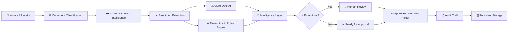
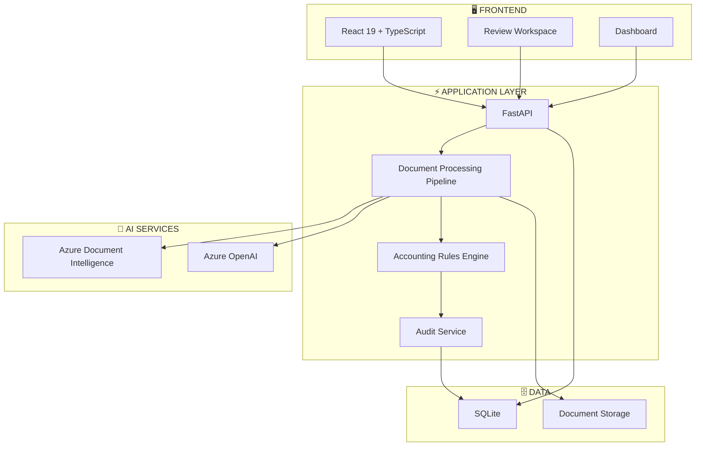

# 🧾 Enterprise Invoice & Receipt Review System

<p align="center">

**AI-Powered Document Intelligence · Deterministic Validation · Human-in-the-Loop Review**

</p>

<p align="center">


</p>

---

## ✨ Product Overview

**Enterprise Invoice & Receipt Review System** is a modern document-processing platform designed to automate invoice and receipt analysis while keeping accounting professionals in control of final decisions.

The platform combines:

> **Azure Document Intelligence**
> ↓
> **AI-powered extraction**
> ↓
> **Deterministic financial validation**
> ↓
> **Exception detection**
> ↓
> **Human review**
> ↓
> **Auditable decision**

It is built for organizations that need **automation without sacrificing financial control, explainability, or auditability**.

---

# 🖥️ Platform Experience

### Modern Accounting Review Workspace

```text
┌──────────────────────────────────────────────────────────────────────────────┐
│                        INVOICE REVIEW CENTER                                │
├───────────────────┬──────────────────────────────┬───────────────────────────┤
│                   │                              │                           │
│  DOCUMENT QUEUE   │       DOCUMENT VIEWER       │     VALIDATION PANEL       │
│                   │                              │                           │
│  ● Invoice #1042  │      ┌────────────────┐      │  ✓ Invoice Number         │
│  ● Invoice #1041  │      │                │      │  ✓ Supplier               │
│  ⚠ Invoice #1040  │      │    INVOICE     │      │  ⚠ PO Missing             │
│  ● Receipt #823   │      │    PREVIEW     │      │  ⚠ Tax Mismatch            │
│                   │      │                │      │  ✓ Total                  │
│                   │      └────────────────┘      │                           │
│                   │                              │  Risk Score:  72 / 100    │
│                   │                              │                           │
│                   │                              │  [Approve] [Review]       │
└───────────────────┴──────────────────────────────┴───────────────────────────┘
```

The interface is designed around the workflow accountants actually need:

**Document → Extracted Data → Validation → Exception → Decision**

---

# 🧠 Intelligent Processing Pipeline



---

# 🏗️ System Architecture



---

# 🔍 Core Capabilities

<table>
<tr>
<td width="33%">

### 🤖 AI Extraction

Multilingual invoice and receipt extraction powered by Azure Document Intelligence.

**Handles:**

* Scanned documents
* Complex tables
* Multiple layouts
* Poor scan quality
* Multilingual documents

</td>

<td width="33%">

### ⚙️ Validation Engine

Deterministic accounting rules independently validate extracted information.

**Detects:**

* Duplicate line items
* Missing POs
* Tax mismatches
* Invalid totals
* Missing fields

</td>

<td width="33%">

### 👤 Human Review

Accounting professionals remain in control.

**Capabilities:**

* Side-by-side review
* Overrides
* Approval/rejection
* Exception handling
* Full audit history

</td>
</tr>
</table>

---

# 🔄 Document Lifecycle

```text
                        ┌───────────────┐
                        │   UPLOAD      │
                        └───────┬───────┘
                                │
                                ▼
                     ┌───────────────────┐
                     │   CLASSIFY        │
                     └─────────┬─────────┘
                               │
                               ▼
                  ┌────────────────────────┐
                  │   AI EXTRACTION        │
                  │ Azure Document         │
                  │ Intelligence           │
                  └────────────┬───────────┘
                               │
                               ▼
                     ┌─────────────────┐
                     │ NORMALIZATION   │
                     └────────┬────────┘
                              │
               ┌──────────────┴──────────────┐
               ▼                             ▼
       ┌────────────────┐           ┌─────────────────┐
       │ Azure OpenAI   │           │ Rules Engine    │
       │ Intelligence   │           │ Validation      │
       └────────┬───────┘           └────────┬────────┘
                │                            │
                └──────────────┬─────────────┘
                               ▼
                      ┌──────────────────┐
                      │ EXCEPTION ENGINE │
                      └────────┬─────────┘
                               │
                     ┌─────────┴──────────┐
                     │                    │
                   PASS                 FLAG
                     │                    │
                     ▼                    ▼
              ┌────────────┐      ┌──────────────┐
              │ APPROVAL   │      │ HUMAN REVIEW │
              └─────┬──────┘      └──────┬───────┘
                    │                    │
                    └─────────┬──────────┘
                              ▼
                       ┌──────────────┐
                       │ AUDIT TRAIL  │
                       └──────────────┘
```

---

# 📊 Validation Intelligence

The system separates **AI interpretation** from **financial validation**.

```text
                 AI
        ┌──────────────────┐
        │ Understand       │
        │ Extract          │
        │ Normalize        │
        └────────┬─────────┘
                 │
                 ▼
        ┌──────────────────┐
        │ Deterministic    │
        │ Rules            │
        ├──────────────────┤
        │ ✓ PO exists      │
        │ ✓ Tax valid      │
        │ ✓ Totals match   │
        │ ✓ No duplicates  │
        │ ✓ Required data  │
        └────────┬─────────┘
                 │
                 ▼
        ┌──────────────────┐
        │ Human Decision   │
        │                  │
        │ Approve          │
        │ Override         │
        │ Reject           │
        └──────────────────┘
```

This architecture prevents AI-generated interpretations from becoming uncontrolled financial decisions.

---

# 📁 Repository Architecture

```text
enterprise-invoice-review/
│
├── 📂 backend/
│   ├── 📂 app/
│   │   ├── API
│   │   ├── Services
│   │   ├── Pipeline
│   │   ├── Rules
│   │   └── Models
│   │
│   ├── 📂 scripts/
│   └── 📄 pyproject.toml
│
├── 📂 frontend/
│   ├── 📂 src/
│   │   ├── components/
│   │   ├── pages/
│   │   ├── services/
│   │   └── types/
│   │
│   └── 📄 vite.config.ts
│
├── 📂 samples/
│   └── invoice & receipt test documents
│
├── 📂 docs/
│   ├── architecture.md
│   ├── azure-deploy.md
│   ├── pricing.md
│   ├── api-and-pipeline.md
│   └── client-brief.md
│
├── 🐳 Dockerfile
├── 🔐 .env.example
└── 📘 README.md
```

---

# 🚀 Quick Start

## 1. Clone the Repository

```bash
git clone <repository-url>
cd enterprise-invoice-review
```

## 2. Configure Azure Services

Create:

```text
.env
```

with:

```env
AZURE_DOCUMENT_INTELLIGENCE_ENDPOINT=https://your-resource.cognitiveservices.azure.com/
AZURE_DOCUMENT_INTELLIGENCE_KEY=your-key

AZURE_OPENAI_ENDPOINT=https://your-resource.openai.azure.com/openai/v1/
AZURE_OPENAI_DEPLOYMENT=gpt-5.6-terra
AZURE_OPENAI_API_KEY=your-key

ALLOWED_ORIGIN=http://localhost:5173
```

---

# ⚡ Start Backend

```bash
cd backend
uv sync --locked --no-dev
```

Initialize the application:

```bash
uv run --locked --no-sync python -c "from app.main import create_app; app = create_app(); print('Database initialized')"
```

Start FastAPI:

```bash
uv run --locked --no-sync uvicorn app.main:create_app \
  --factory \
  --host 0.0.0.0 \
  --port 8000
```

---

# ⚛️ Start Frontend

```bash
cd frontend
pnpm install --frozen-lockfile
pnpm dev
```

Open:

```text
http://localhost:5173
```

API documentation:

```text
http://localhost:8000/docs
```

---

# 🐳 Production Container

```bash
docker build -t invoice-review:latest .
```

Then:

```bash
docker run \
  -p 8000:8000 \
  -p 5173:5173 \
  -e AZURE_DOCUMENT_INTELLIGENCE_ENDPOINT="..." \
  -e AZURE_DOCUMENT_INTELLIGENCE_KEY="..." \
  -e AZURE_OPENAI_ENDPOINT="..." \
  -e AZURE_OPENAI_DEPLOYMENT="..." \
  -e AZURE_OPENAI_API_KEY="..." \
  invoice-review:latest
```

---

# 🛡️ Security Architecture

```text
                    🔐 SECRETS
                        │
                        ▼
                 Environment /
                 Secret Manager
                        │
          ┌─────────────┴─────────────┐
          ▼                           ▼
   Azure Credentials            Application Secrets
          │                           │
          └─────────────┬─────────────┘
                        ▼
                 Backend Services
                        │
            ┌───────────┴───────────┐
            ▼                       ▼
      Secure Documents        Audit Records
```

### Production Security Principles

🔒 Never commit credentials
🔒 Restrict CORS origins
🔒 Protect uploaded financial documents
🔒 Use managed secrets in production
🔒 Persist databases outside ephemeral containers
🔒 Apply access controls to document storage
🔒 Maintain audit history for decisions

---

# 📚 Documentation

| Resource                      | Purpose                     |
| ----------------------------- | --------------------------- |
| 🏛️ `docs/architecture.md`    | System architecture         |
| ☁️ `docs/azure-deploy.md`     | Azure deployment            |
| 💰 `docs/pricing.md`          | Infrastructure and pricing  |
| 🔌 `docs/api-and-pipeline.md` | API and processing pipeline |
| 📋 `docs/client-brief.md`     | Product requirements        |

---

# 🧪 Development Quality

### Backend

```bash
uv run --locked --no-sync ruff check app scripts
```

### Frontend

```bash
pnpm lint
```

```bash
pnpm build
```

```bash
pnpm exec tsc -b
```

### Development Principles

```text
Type Safety
     +
Deterministic Validation
     +
Testable Business Rules
     +
Secure Configuration
     +
Auditable Decisions
     =
Production-Ready Architecture
```

---

# 🎯 Design Philosophy

The platform is built around one core principle:

> **Automate the work, not the accountability.**

AI handles document understanding and extraction.

Deterministic rules handle financial validation.

Humans make final decisions.

The audit layer records what happened.

This creates an architecture that is **AI-assisted, financially controlled, explainable, and enterprise-oriented**.

---

# 🏁 Project Status

**Enterprise Invoice & Receipt Review System**

**Architecture:** ✅ Modular
**Document Intelligence:** ✅ Azure-powered
**AI Processing:** ✅ Azure OpenAI
**Validation Engine:** ✅ Deterministic
**Human Review:** ✅ Supported
**Auditability:** ✅ Built into workflow
**Containerization:** ✅ Docker
**API:** ✅ FastAPI / OpenAPI
**Frontend:** ✅ React + TypeScript

---

<p align="center">

### Built for intelligent financial document operations.

**AI × Automation × Human Control × Auditability**

</p>
# Invoice-Azur

