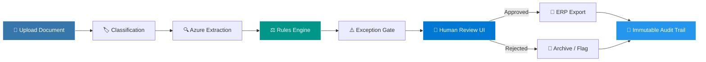
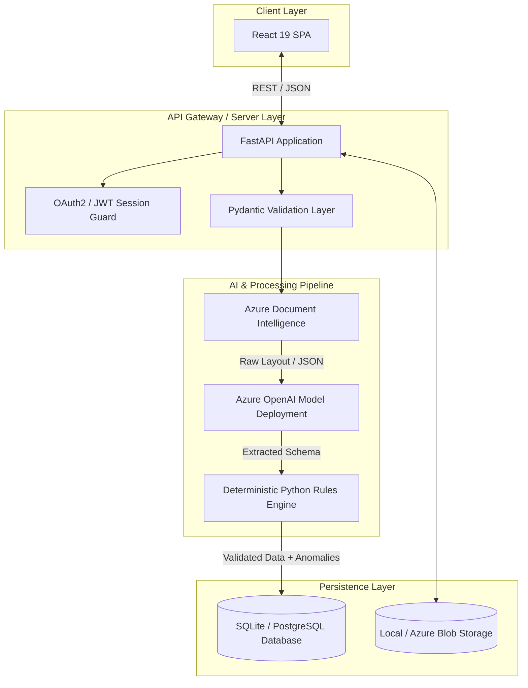

<div align="center">

# 🧾 Enterprise Invoice & Receipt Review System

**An enterprise-grade document intelligence platform combining automated OCR extraction, LLM field validation, deterministic financial rules, and human-in-the-loop exception workflows.**

[](https://python.org)
[](https://fastapi.tiangolo.com)
[](https://react.dev)
[](https://www.typescriptlang.org)
[](https://azure.microsoft.com)
[](https://www.docker.com)

<br />

<a href="#-overview">Overview</a> •
<a href="#-key-features">Features</a> •
<a href="#-system-architecture">Architecture</a> •
<a href="#-technology-stack">Tech Stack</a> •
<a href="#-getting-started">Getting Started</a> •
<a href="#-documentation">Documentation</a>

<br />


</div>

---

## 📌 Overview

The **Enterprise Invoice & Receipt Review System** bridges the gap between probabilistic AI extractions and deterministic accounting requirements. Designed for high-volume accounts payable (AP) workflows, it automates line-item processing, multi-currency detection, and tax verification while retaining human oversight for financial exceptions.

### Processing Pipeline



---

## ✨ Key Features

### 🔍 Automated Extraction & Semantic Structuring

* **Multi-Format Processing**: Native support for PDF, PNG, JPEG, and TIFF scans.
* **Layout Agnostic**: Handles unstructured receipts, variable multi-page invoices, and complex tabular data.
* **Multilingual OCR**: Contextual field mapping across global vendor formats.

### 🛡️ Deterministic Financial Validation Engine

* **Rule-Based Auditing**: Validates line-item calculations, sub-totals, and tax amounts against hard mathematical constraints.
* **PO Matching & Verification**: Cross-checks extracted data against Purchase Orders (POs) and vendor master records.
* **Anomaly Detection**: Highlights duplicate submissions, missing tax IDs, mismatched vendor addresses, and currency anomalies.

### 👤 Human-in-the-Loop (HITL) Review Portal

* **Side-by-Side Review Workspace**: Synchronized PDF bounding-box viewer paired with dynamic data editing panels.
* **One-Click Corrections**: Overrides AI-extracted values with real-time recalculations.
* **Granular Audit Logs**: Tracks field-level mutations, decision timestamps, and reviewer identities.

---

## 🏗️ System Architecture

The core architecture decouples **AI document interpretation** from **financial business logic execution**:



---

## 🛠️ Technology Stack

| Domain | Technology | Purpose |
| --- | --- | --- |
| **Backend Engine** | Python 3.12+ · FastAPI · Pydantic v2 | High-performance asynchronous API & type enforcement |
| **Frontend UI** | React 19 · TypeScript · Tailwind CSS | Component architecture and UI state management |
| **AI Processing** | Azure Document Intelligence | Structural layout parsing, table extraction, and OCR |
| **LLM Inference** | Azure OpenAI (GPT-4o / GPT-5) | Contextual entity extraction, translation, and classification |
| **Package Management** | `uv` (Backend) · `pnpm` (Frontend) | Fast, deterministic dependency resolution |
| **Database** | SQLite (Dev) / PostgreSQL (Prod) | Structured metadata, user logs, and exception states |
| **Containerization** | Docker | Production container configuration |

---

## 📁 Repository Structure

```text
.
├── backend/
│   ├── app/
│   │   ├── api/          # FastAPI route handlers & endpoints
│   │   ├── core/         # System configurations & security logic
│   │   ├── models/       # Database ORM models & Pydantic schemas
│   │   ├── services/     # Azure AI integrations & Business logic
│   │   └── main.py       # Application gateway factory
│   ├── scripts/          # Database seeding & migration scripts
│   └── pyproject.toml    # Backend environment dependencies (uv)
│
├── frontend/
│   ├── src/
│   │   ├── components/   # Modular React UI components
│   │   ├── pages/        # Route view containers
│   │   └── services/     # API integration clients
│   ├── package.json
│   └── vite.config.ts    # Bundler configuration
│
├── docs/                 # System design docs & architecture guides
├── samples/              # Test document samples (PDFs, Images)
├── Dockerfile            # Multi-stage production container setup
└── .env.example          # Environment variable template

```

---

## 🚀 Getting Started

### Prerequisites

* **Python**: `v3.12+`
* **Node.js**: `v22+`
* **Package Managers**: [`uv`](https://www.google.com/search?q=https://github.com/astral-sh/uv) and [`pnpm`](https://www.google.com/search?q=https://pnpm.io/)
* **Azure Subscriptions**: Configured access to **Azure Document Intelligence** & **Azure OpenAI**

---

### Environment Configuration

Create a local environment configuration file based on the provided template:

```bash
cp .env.example .env

```

Update your `.env` with valid Azure AI credentials:

```env
# Azure Document Intelligence Config
AZURE_DOCUMENT_INTELLIGENCE_ENDPOINT="https://<your-resource>[.cognitiveservices.azure.com/](https://.cognitiveservices.azure.com/)"
AZURE_DOCUMENT_INTELLIGENCE_KEY="your-azure-di-key"

# Azure OpenAI Configuration
AZURE_OPENAI_ENDPOINT="https://<your-resource>[.openai.azure.com/](https://.openai.azure.com/)"
AZURE_OPENAI_DEPLOYMENT="gpt-4o"
AZURE_OPENAI_API_KEY="your-azure-openai-key"

# System Settings
ALLOWED_ORIGIN="http://localhost:5173"
DATABASE_URL="sqlite:///./app.db"

```

> [!IMPORTANT]
> Never commit secrets, `.env` files, or production documents to your public repository.

---

### 1. Backend Setup

Initialize dependencies and start the API engine using `uv`:

```bash
cd backend

# Install dependencies with locked versions
uv sync --locked

# Initialize SQLite database schema
uv run --locked python -c "from app.main import create_app; create_app()"

# Launch local API development server
uv run --locked uvicorn app.main:create_app --factory --host 0.0.0.0 --port 8000 --reload

```

* **API Gateway**: `http://localhost:8000`
* **Interactive OpenAPI Specs**: `http://localhost:8000/docs`

---

### 2. Frontend Setup

Install dependencies and launch the Vite client:

```bash
cd frontend

# Install client packages
pnpm install --frozen-lockfile

# Launch local development engine
pnpm dev

```

* **Client Web UI**: `http://localhost:5173`

---

### 3. Docker Deployment

Deploy the combined unified application container:

```bash
# Build production Docker image
docker build -t enterprise-invoice-review:latest .

# Run application container
docker run -d \
  --name invoice-system \
  -p 8000:8000 \
  -p 5173:5173 \
  --env-file .env \
  enterprise-invoice-review:latest

```

---

## 🔒 Security & Compliance

> [!WARNING]
> Financial data processing requires strict operational guardrails in enterprise environments.

* **Transport & Storage Encryption**: Data should be encrypted at rest (AES-256) and in transit (TLS 1.3).
* **Identity Management**: Integrate OAuth2/OIDC via Microsoft Entra ID (Azure AD) for SSO.
* **Audit Transparency**: All human modifications are logged with user ID, IP metadata, before/after field state, and time.
* **Document Persistence**: Uploaded assets should be stored on resilient object stores (e.g., Azure Blob Storage) with Lifecycle Management rules enabled.

---

## 📚 Technical Documentation Index

| Document | Focus Area |
| --- | --- |
| 📖 [System Architecture Guide](https://www.google.com/search?q=docs/architecture.md) | In-depth breakdown of module decouplings and data flows. |
| ☁️ [Azure Deployment Pipeline](https://www.google.com/search?q=docs/azure-deploy.md) | Step-by-step production setup on Azure Container Apps. |
| 💰 [Pricing & Sizing Analysis](https://www.google.com/search?q=docs/pricing.md) | Cost estimation models for Document Intelligence & OpenAI usage. |
| ⚡ [API Specification & Data Pipelines](https://www.google.com/search?q=docs/api-and-pipeline.md) | REST API specs, JSON schemas, and hooks. |

---

## 💡 Core Engineering Principles

> **"Automate repetitive extraction. Enforce rules deterministically. Leave final accountability to humans."**

1. **Deterministic Rules Over Generative Guesses**: Generative models parse document context, but financial calculations are always validated via deterministic Python code.
2. **Strict Reproducibility**: High-precision package lockfiles (`uv.lock`, `pnpm-lock.yaml`) ensure consistent builds.
3. **Audit Readiness**: Every document change creates an immutable event log entry.

---